# Worlder Team Microservice Server

A comprehensive microservice backend system built with Go, Echo, MySQL, GORM, and gRPC following clean architecture principles.

## Architecture Overview

This system consists of two main microservices:

### Microservice A (Data Generator Service)
- Generates sensor data streams with configurable frequency
- Multiple instances can run with different sensor types
- REST API for frequency control
- gRPC client to send data to Microservice B

### Microservice B (Data Storage Service)
- Receives sensor data via gRPC
- Stores data in MySQL database using GORM
- Comprehensive REST API for data management
- Authentication & authorization
- Pagination support
- Scalable to handle multiple data sources

## System Architecture Diagram

```mermaid
graph TB
    %% External clients
    Client["`🌐 **HTTP Clients**
    Postman/Browser/API`"]
    
    %% Load balancer
    LB["`🔄 **Nginx Load Balancer**
    Port: 80`"]
    
    %% Microservice A instances
    subgraph GenA [" "]
        direction TB
        A1["`🌡️ **Temperature**
        Port: 8081
        REST + gRPC`"]
        A2["`💧 **Humidity**
        Port: 8082
        REST + gRPC`"]  
        A3["`📊 **Pressure**
        Port: 8083
        REST + gRPC`"]
        A4["`💡 **Light**
        Port: 8084
        REST + gRPC`"]
        A5["`🚶 **Motion**
        Port: 8085
        REST + gRPC`"]
    end
    
    %% Microservice B
    subgraph StorageB [" "]
        direction TB
        B["`🗄️ **Storage Service**
        Port: 8080
        REST API + gRPC Server`"]
        
        subgraph Layers [" "]
            direction LR
            BH["`📝 **Handlers**
            Controllers`"]
            BS["`⚙️ **Services**
            Business Logic`"]
            BR["`📦 **Repository**
            Data Access`"]
        end
        
        subgraph Modules [" "]
            direction LR
            AUTH["`🔐 **Auth**
            JWT`"]
            SENSOR["`📊 **Sensor Data**
            CRUD Ops`"]
            HEALTH["`❤️ **Health**
            Monitoring`"]
        end
    end
    
    %% Database
    DB["`🗃️ **MySQL Database**
    Port: 3306
    GORM ORM`"]
    
    %% Redis
    REDIS["`🔴 **Redis Cache**
    Port: 6379
    Sessions`"]
    
    %% Documentation
    SWAGGER["`📚 **Swagger UI**
    API Documentation
    :8080/swagger`"]
    
    %% Connections - HTTP REST
    Client --> LB
    LB --> B
    Client --> A1
    Client --> A2  
    Client --> A3
    Client --> A4
    Client --> A5
    
    %% gRPC connections
    A1 -.->|"`**gRPC**
    SendSensorData`"| B
    A2 -.->|"`**gRPC**
    SendSensorData`"| B
    A3 -.->|"`**gRPC**
    SendSensorData`"| B
    A4 -.->|"`**gRPC**
    SendSensorData`"| B
    A5 -.->|"`**gRPC**
    SendSensorData`"| B
    
    %% Internal flow
    B --> BH
    BH --> BS
    BS --> BR
    BR --> DB
    
    %% Module connections
    B --> AUTH
    B --> SENSOR
    B --> HEALTH
    
    %% Database connections
    AUTH -.-> DB
    SENSOR -.-> DB
    B -.-> REDIS
    
    %% Documentation
    B -.-> SWAGGER
    
    %% Light mode styling
    classDef generators fill:#e3f2fd,stroke:#1976d2,stroke-width:2px,color:#000
    classDef storage fill:#f3e5f5,stroke:#7b1fa2,stroke-width:2px,color:#000
    classDef database fill:#e8f5e8,stroke:#388e3c,stroke-width:2px,color:#000
    classDef client fill:#fff8e1,stroke:#f57c00,stroke-width:2px,color:#000
    classDef infrastructure fill:#fce4ec,stroke:#c2185b,stroke-width:2px,color:#000
    classDef groupBox fill:#f5f5f5,stroke:#616161,stroke-width:1px,color:#000
    
    class A1,A2,A3,A4,A5 generators
    class B,BH,BS,BR,AUTH,SENSOR,HEALTH storage
    class DB,REDIS database
    class Client,SWAGGER client
    class LB infrastructure
    class GenA,StorageB,Layers,Modules groupBox
```



### Architecture Principles

- **Clean Architecture**: Each microservice follows clean architecture with clear separation of concerns
- **Modularity**: Feature-based module organization for maintainability
- **Scalability**: Horizontal scaling through multiple generator instances
- **Communication**: gRPC for inter-service communication, REST for client APIs
- **Data Flow**: Unidirectional data flow from generators to storage
- **Authentication**: JWT-based authentication

### Data Flow

1. **Data Generation**: Microservice A instances generate sensor data at configurable frequencies
2. **gRPC Transmission**: Generated data is sent to Microservice B via gRPC for efficiency
3. **Data Storage**: Microservice B stores received data in MySQL using GORM
4. **API Access**: Clients can query stored data through REST APIs with pagination and filtering
5. **Authentication**: All API requests are authenticated using JWT tokens
6. **Load Balancing**: Nginx distributes HTTP traffic across service instances

## Project Structure

```
worlder-team-microservice-server/
├── microservice-a/              # Data Generator Service
│   ├── cmd/
│   │   └── server/
│   │       └── main.go         # Application entry point
│   ├── modules/               # Feature-based organization
│   │   ├── generator/         # Data generation & sensor management
│   │   │   ├── entities/      # SensorData & GeneratorStatus entities
│   │   │   ├── handlers/      # Generator HTTP handlers
│   │   │   ├── services/      # Data generation business logic
│   │   │   ├── interfaces/    # Generator & client interfaces
│   │   │   ├── dtos/          # Frequency request/response DTOs
│   │   │   └── grpc/          # gRPC client implementation
│   │   └── health/            # Health check endpoints
│   │       └── handlers/      # Health handlers
│   ├── configs/               # Configuration management
│   │   └── config.go         # Config struct and loading
│   ├── shared/               # Local shared types (APIResponse)
│   └── Dockerfile            # Container build configuration
├── microservice-b/              # Data Storage Service
│   ├── cmd/
│   │   └── server/
│   │       └── main.go         # Application entry point
│   ├── modules/               # Feature-based organization
│   │   ├── auth/              # Authentication & user management
│   │   │   ├── entities/      # User entity with GORM tags
│   │   │   ├── handlers/      # Auth HTTP handlers (login, etc.)
│   │   │   ├── services/      # Auth & JWT token services
│   │   │   ├── interfaces/    # Auth service interfaces
│   │   │   └── dtos/          # Auth request/response DTOs
│   │   ├── sensor-data/       # Sensor data management
│   │   │   ├── entities/      # SensorData entity with GORM tags
│   │   │   ├── handlers/      # Sensor CRUD HTTP handlers
│   │   │   ├── services/      # Sensor business logic
│   │   │   ├── repositories/  # Data access layer (GORM)
│   │   │   ├── interfaces/    # Service & repository interfaces
│   │   │   ├── dtos/          # DTOs, filters & pagination
│   │   │   └── grpc/          # gRPC server implementation
│   │   └── health/            # Health check endpoints
│   │       └── handlers/      # Health check handlers
│   ├── configs/               # Configuration management
│   │   ├── config.go         # Config struct and loading
│   │   └── logger.go         # Logger configuration
│   ├── shared/               # Local shared types (APIResponse)
│   ├── docs/                 # Auto-generated Swagger docs
│   └── Dockerfile            # Container build configuration
├── shared/                      # Shared components across services
│   ├── proto/                 # Protocol buffer definitions
│   │   └── sensor/           # Sensor service protobuf files
│   ├── constants/             # Shared constants (status codes, etc.)
│   ├── utils/                 # Utility functions (logging, parsing)
│   ├── middleware/            # Shared HTTP middleware
│   └── response.go           # Standard API response structure
├── infrastructures/            # Infrastructure configurations
│   └── nginx/                # Load balancer configuration
│       └── nginx.conf        # Nginx proxy settings
├── .env                       # Environment variables (copy from .env.example)
├── .env.example              # Environment variables template
├── docker-compose.yml        # Multi-service orchestration
├── Makefile                  # Build and deployment automation
└── README.md                 # This file
```

## Database Schema (ERD)

The system uses MySQL database with the following entity relationships:


### Database Tables

**users table** - Authentication and user management
- `id` (Primary Key, Auto Increment)
- `username` (Unique, VARCHAR(100))
- `email` (Unique, VARCHAR(100))
- `password` (Hashed, VARCHAR(255))
- `role` (VARCHAR(50), Default: 'user')
- `created_at`, `updated_at`, `deleted_at` (Timestamps)

**sensor_data table** - All sensor readings storage
- `id` (Primary Key, Auto Increment)
- `sensor_value` (DECIMAL(10,4)) - Sensor reading value
- `sensor_type` (VARCHAR(50)) - temperature, humidity, pressure, light, motion
- `id1` (VARCHAR(50)) - Generator instance identifier
- `id2` (INTEGER) - Secondary identifier
- `timestamp` (TIMESTAMP) - When the data was generated
- `created_at`, `updated_at`, `deleted_at` (Timestamps)

## Quick Start

### Prerequisites
- Go 1.23+
- Docker & Docker Compose
- MySQL 8.0+

### Using Makefile (Recommended)

1. **Clone and navigate to project**:
```bash
git clone https://github.com/mch-fauzy/worlder-team-microservice-server.git
cd worlder-team-microservice-server
```

2. **Set up environment variables**:
```bash
# Copy the example environment file
cp .env.example .env

# Edit the .env file with your preferred settings
nano .env
# or
vim .env
```

> **Important**: The `.env` file contains all configuration including database credentials, JWT secrets, and service ports. Review and modify the values as needed for your environment.

3. **Start all services with one command**:
```bash
make quick-start
```

### After Starting Services

Once services are running, you can access:

- **Storage Service (Microservice B)**: http://localhost:8080
- **Temperature Sensor Service**: http://localhost:8081
- **Humidity Sensor Service**: http://localhost:8082  
- **Pressure Sensor Service**: http://localhost:8083
- **Light Sensor Service**: http://localhost:8084
- **Motion Sensor Service**: http://localhost:8085
- **Load Balancer**: http://localhost:80

### Available Makefile Commands

| Command | Description |
|---------|-------------|
| `make help` | Show all available commands |
| `make quick-start` | Start all services quickly |
| `make run` | Start all services with Docker Compose |
| `make stop` | Stop all services |
| `make restart` | Restart all services |
| `make rebuild` | Rebuild and restart all services |
| `make rebuild-generators` | Rebuild only microservice-a generators |
| `make rebuild-storage` | Rebuild only microservice-b storage service |
| `make logs` | View logs from all services |
| `make clean` | Clean up containers and volumes |
| `make proto` | Generate protobuf files |
| `make swagger` | Generate Swagger documentation |

### Troubleshooting

**Services not starting?**
```bash
# 1. Check if .env file exists and is configured
ls -la .env
cat .env

# 2. Verify environment variables are loaded
docker-compose config

# 3. Clean and restart services
make clean
make quick-start
```

**Need to rebuild after changes?**
```bash
make rebuild
```

**Database connection issues?**
```bash
# Wait for MySQL to be ready, then restart
make logs
# Wait until you see "MySQL ready for connections"
make restart
```

## API Documentation

### Microservice A Endpoints
- `GET /health` - Health check
- `GET /status` - Get generator status
- `POST /frequency` - Set data generation frequency
- `GET /frequency` - Get current frequency
- `POST /start` - Start data generation
- `POST /stop` - Stop data generation

### Microservice B Endpoints
- `POST /auth/login` - Authentication
- `GET /sensors` - List sensor data (with pagination and filtering)
- `GET /sensors/{id}` - Get sensor data by ID
- `GET /sensors/{id1}/{id2}` - Get by ID combination
- `GET /sensors/duration` - Get by time range
- `PATCH /sensors/{id}` - Update sensor data (partial update)
- `DELETE /sensors/{id}` - Delete sensor data by ID

#### Default Login Credentials

Use these credentials to authenticate and access protected endpoints:

```json
{
  "email": "admin@example.com",
  "password": "password"
}
```

```json
{
  "email": "user@example.com", 
  "password": "testuser123"
}
```

> **Note**: These are default seeded users for development/demo purposes.

Full API documentation is available at `/swagger/index.html` when running the services.

### Postman Collection

A comprehensive Postman collection is available for testing all API endpoints:

📁 **[Download Postman Collection](docs/api/worlder-team-microservice-server.postman_collection.json)**

